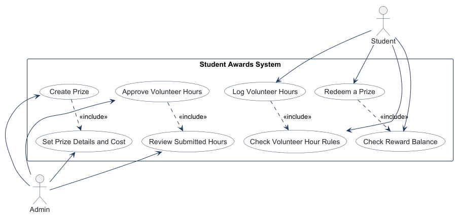
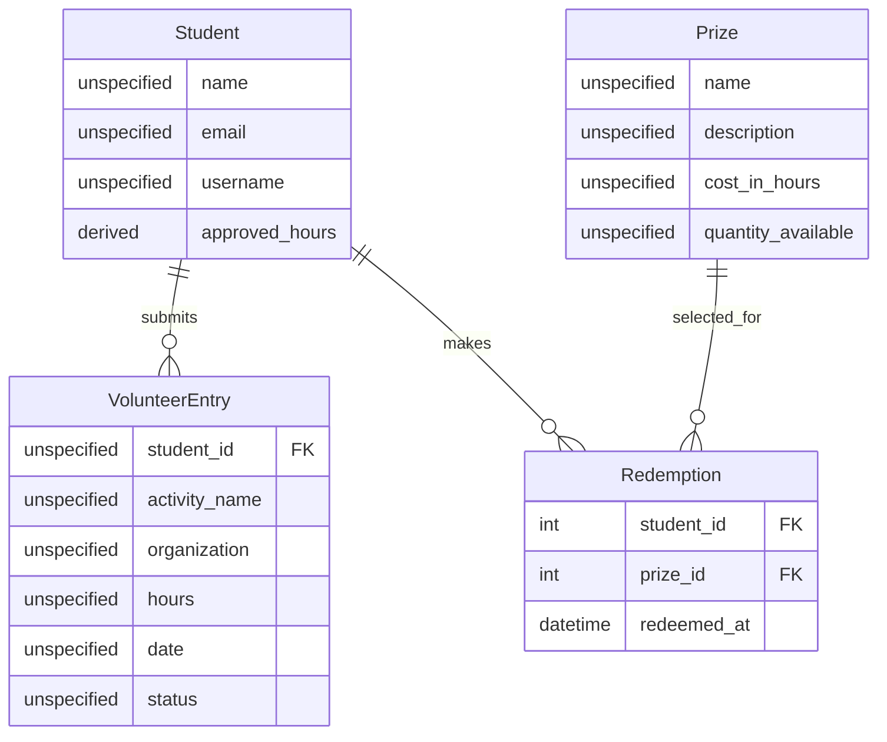
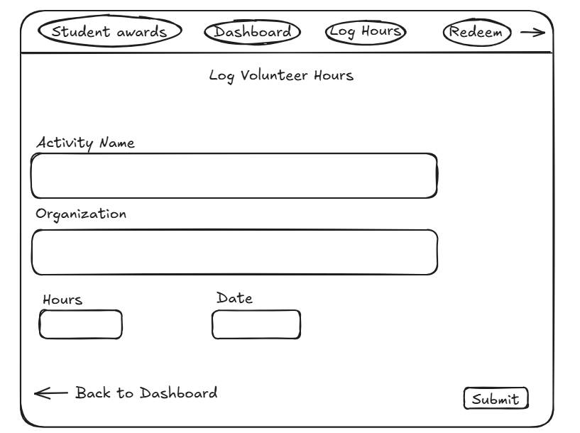
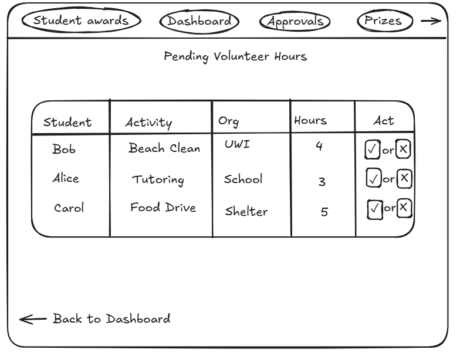
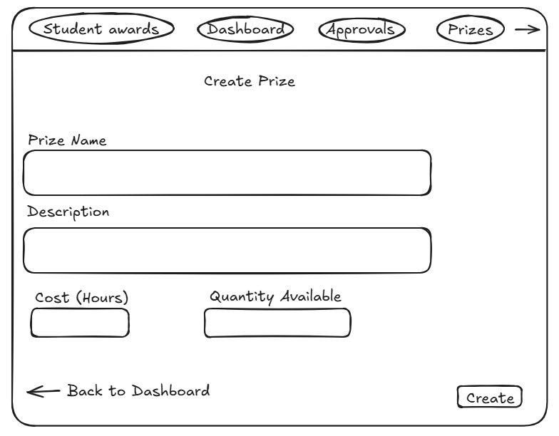
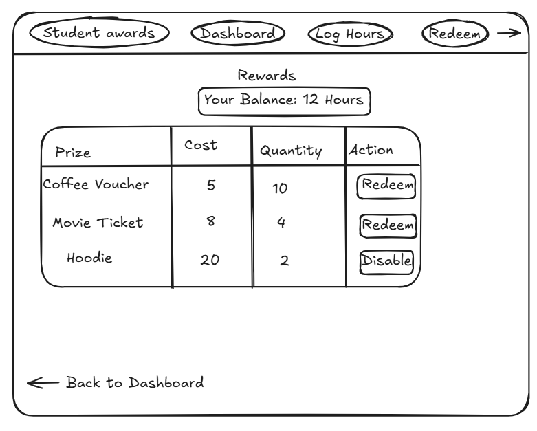

<!-- student-build:skill-integrity
status: pass
root: e84cd692d0b85eefe546385661958c27d07e8be6c5176a82012f68ccff5c8beb
expected_root: e84cd692d0b85eefe546385661958c27d07e8be6c5176a82012f68ccff5c8beb
mismatches: none
-->

# COMP 3613 Assignment 1

Draft this file with the Guide. **Update it after every phase milestone** before you pause. The use-case diagram is a UML PNG at `docs/diagrams/use-case.png`, linked from this file as `diagrams/use-case.png` (path relative to `docs/report.md`). The model diagram is Mermaid. **Embed wireframe images** as `wireframes/<file>` (files live in `docs/wireframes/`).

Do not put your student ID in this file if you will commit it. The PDF cover adds your name and ID at export time.

## Assigned project

Student Awards (incentive system)

## Named workflows

### 1. Log Volunteer Hours (Student)

### 2. Approve Volunteer Hours (Admin)

### 3. Create Prize (Admin)

### 4. Redeem a Prize (Student)

## Use case diagram

Phase 2 draft notes:

- Student and Admin are the two actors in the system.
- The four named workflows remain the core use cases: Log Volunteer Hours, Approve Volunteer Hours, Create Prize, and Redeem a Prize.
- Shared steps are modelled as includes: Log Volunteer Hours includes checking the volunteer-hour rules, Approve Volunteer Hours includes reviewing submitted entries, Create Prize includes setting prize details and cost, and Redeem a Prize includes checking the reward balance.
- No second product or extra actor was introduced beyond the Student Awards incentive system.

## Model diagram

Phase 3 first draft. Attribute types are intentionally unspecified because they were not provided.

Phase 5 model revision: the implemented `Redemption` table has `student_id` and `prize_id` foreign keys plus a `redeemed_at` timestamp. Spendable balance is derived as approved volunteer hours less the cost of recorded redemptions; it is not stored on Student.

Phase 3 relationship and rule notes:

- A student can have many volunteer entries; each entry belongs to exactly one student, with `student_id` on `VolunteerEntry`.
- A student can have many redemptions over time; each redemption belongs to exactly one student, with `student_id` on `Redemption`.
- A prize can appear in many redemption records over time; each redemption refers to exactly one prize, with `prize_id` on `Redemption`.
- `Student.approved_hours` is derived as the sum of that student's `VolunteerEntry.hours` where `status = 'Approved'`; it is not stored independently.
- A redemption is allowed only when approved hours are at least `Prize.cost_in_hours` and `Prize.quantity_available > 0`. On success, decrement the prize quantity by one and create a `Redemption` record.
- Student IDs and redemption IDs were not listed as properties; the diagram leaves unprovided identifiers unspecified.
- Update this section in Phase 5 if polish revises the model, and note what changed.

## Wireframes

### Log Volunteer Hours

### Approve Volunteer Hours

The updated admin wireframe includes both an Approve and a Reject action for each volunteer-hours submission, matching the expected status decision flow in the model.

### Create Prize

### Redeem a Prize

### Phase 4 coverage review

- The student workflow is represented clearly: dashboard navigation leads to a log-hours form with `activity_name`, `organization`, `hours`, and `date`, which matches the `VolunteerEntry` model in the ERD.
- The admin approval flow is represented with a pending table showing student, activity, organization, hours, and an approval action; this matches the `VolunteerEntry.status` concept and the approval decision process.
- The create-prize flow matches the `Prize` entity: name, description, cost in hours, and quantity available are all captured.
- The redeem-prize flow matches the `Redemption` concept and the prize listing: prize, cost, quantity, and current balance are displayed, with a redemption action.
- The main gap is workflow completeness rather than data shape: the wireframes do not yet show the post-submit confirmation state for log hours, the final approval/result state for admin review, or the failure state for insufficient balance / unavailable prize when redeeming.
- The model is still consistent with the wireframes; the only improvement to flag is that the implementation should make the resulting status transitions explicit in the UI (`Pending`, `Approved`, `Rejected`, and the redemption success/failure states) so the design clearly covers the business rules in the ERD.

## Theming

Brand: **Bloom** — a text-only wordmark in the top-left navigation.

- Colors: primary light green `#22c55e`, soft mint `#dcfce7`, dark slate `#0f172a`, and white `#ffffff`.
- Type: Inter with system sans-serif fallbacks.
- Tone: fresh, encouraging, and community-volunteering focused.
- Applied the Bloom palette and wordmark to the public landing page, login, registration, and authenticated shell. Replaced placeholder landing copy with Student Awards messaging and removed the public demo-credentials note. The `/config` panel and starter authentication remain available.

## Implementation notes

Phase 5 theming milestone: Bloom branding is applied to landing, login, registration, and the authenticated navigation shell.

Log Volunteer Hours choice: after submission, redirect back to the form and show the flash message “Entry submitted pending approval.”

Log Volunteer Hours verification: signed in as `bob`, opened `/volunteer-hours`, and submitted “Beach Clean / UWI / 4 / 2026-10-06”. The form rendered, the entry submitted, the pending-approval flash appeared, and the redirect returned to the form.

Polish from verification: added a student-only Log Hours sidebar link and replaced the authenticated student home placeholder with a Bloom welcome dashboard and a direct Log volunteer hours action. Approval/reward copy explains the workflow without claiming an uncomputed balance.

Workflow 1 completion verification: signed in as `bob`; confirmed the Bloom dashboard replaced the placeholder, the sidebar Log Hours link opened the form, and submitting “Beach Clean / UWI / 4 / 2026-10-06” displayed the pending-approval flash and redirected to the form. Confirmed the primary action buttons use the Bloom green theme. **Log Volunteer Hours is complete.**

Approve Volunteer Hours implementation choice: each pending entry will have one decision form with Approve and Reject submit buttons. The route reads the submitted action and calls one service method, which branches on the action; the repository owns persistence.

<!-- student-build:code-check
workflow: Approve Volunteer Hours
form: choice
layer: other
architecture_ok: yes
implement_confidence: 0.90
passed: yes
note: Chose one per-entry decision form; route passes action to one branching service method and persistence stays in repository.
-->

Approve Volunteer Hours implementation: the admin review table lists pending entries with student, activity, organization, and hours; the service maps the submitted action to `Approved` or `Rejected`, and the repository owns the entry query and status update. The model uses `VolunteerEntryStatus` for `Pending`, `Approved`, and `Rejected`.

Approval page routing update: added the named admin-only GET endpoint `admin_review_hours` at `/admin/volunteer-hours`. It supplies pending entries to the existing admin review template, so the review POST redirect resolves to the page after an action.

Workflow 2 verification: signed in as admin, opened the review page, saw Bob’s pending entry, clicked Approve, saw “Entry 1 approved.”, and confirmed the entry disappeared from the pending list. The route catches service `ValueError`s and flashes the result; the service uses `VolunteerEntryStatus`, and the repository owns the database update. **Approve Volunteer Hours is complete.**

Scope decision: do not show an approved-hours total on the student dashboard. Compute the approved-hours sum in Workflow 4 (Redeem a Prize), where the balance is needed to enforce redemption eligibility.

Create Prize implementation choice: use a standalone admin form at `GET /admin/prizes/new`, reached from a Prizes navigation link alongside Approvals. The POST endpoint creates the prize.

<!-- student-build:code-check
workflow: Create Prize
form: choice
layer: other
architecture_ok: yes
implement_confidence: 0.90
passed: yes
note: Chose a standalone admin form page reached through the Prizes navigation entry; POST creates the prize.
-->

Create Prize implementation: added the admin-only GET form route and wireframe-matched standalone form, plus the Prize repository/service. The service delegates persistence through the repository. After adding the Prize model, the database schema was recreated with `python manage.py init`.

Workflow 3 verification: signed in as admin, clicked Prizes, opened the create-prize form, and submitted “Coffee Voucher / Free coffee at the campus café / 5.0 / 10”. The app displayed “Prize 'Coffee Voucher' created.” and redirected back to the form. Confirmed the page matches `create-prize.png`. **Create Prize is complete.**

Redeem a Prize implementation choice: on success, use POST-redirect-GET back to the rewards list, show a success flash, and recalculate the approved-hours balance and prize quantities. On insufficient balance or out-of-stock failures, return to the same list with a failure flash; no separate confirmation page. The approved-hours total is calculated here rather than on the student dashboard.

<!-- student-build:code-check
workflow: Redeem a Prize
form: choice
layer: other
architecture_ok: yes
implement_confidence: 0.90
passed: yes
note: Chose POST-redirect-GET to refresh rewards, balance, and quantities with success/failure flash feedback.
-->

Redeem a Prize implementation: added student rewards navigation and a rewards list matching `redeem-prize.png`. The repository calculates spendable balance as approved volunteer hours minus the cost of recorded redemptions, loads available prizes, and atomically decrements inventory while recording the redemption. The service enforces sufficient balance and in-stock quantity. The Redemption model and thin POST route are implemented; the route catches service `ValueError`s, flashes the outcome, and redirects to Rewards.

<!-- student-build:code-check
workflow: Redeem a Prize
form: snippet
layer: model
architecture_ok: yes
implement_confidence: 0.90
passed: yes
note: Completed Redemption table fields for student/prize foreign keys and redemption timestamp.
-->

<!-- student-build:code-check
workflow: Redeem a Prize
form: snippet
layer: router
architecture_ok: yes
implement_confidence: 0.90
passed: yes
note: Completed thin redemption POST route; delegates decision to service, flashes result, and redirects to Rewards without persistence logic.
-->

Workflow 4 verification: rebuilt the database schema with `python manage.py init` after adding the Redemption table. Then Bob logged volunteer hours, admin approved the entry, and admin created a prize costing within Bob’s balance. Bob opened Rewards and saw the balance and prize list, with unaffordable prizes disabled. After redeeming, the balance and quantity each decreased appropriately; the success flash appeared, and revisiting Rewards showed the refreshed values. Confirmed the page matches `redeem-prize.png`. **Redeem a Prize is complete.**

Phase 5 local exit gate: all four named workflows have been verified end-to-end locally, and the student has steered branding, workflow outcomes, navigation, and model/balance scope. Local polish is complete; deployment remains Phase 6.

Phase 5 completion: all four named workflows are implemented and locally verified; branding and workflow polish are documented above. The remaining assignment phase is deployment.

## Deployed app

Phase 6 complete. Public Render URL (not localhost). Markers can use this URL to review the four workflows.

https://faststarter-hk9q.onrender.com

Deployment status: Render Postgres and the web service are running in Oregon on the free plan from the `main` branch. `DATABASE_URI` is configured. Render MCP confirms the Postgres database is available, the latest build and deploy succeeded, and the web service/deployment status is live. The public `/health` endpoint returned `{"ok":true}`. In an incognito browser, the student also signed in as both `bob` and `admin` and verified all four named workflows end-to-end.

## Source repository

[GitHub repository](https://github.com/Mark-Mooradan/comp3613a1)

## Logins

Every account a marker needs, including extra users you added. Starter accounts:

- bob / bobpass — regular user
- admin / adminpass — admin

## YouTube URL

https://youtu.be/YZ_tXd8GzIg

## Session transcripts

Filled when the Guide builds the report: the agent writes chat markdown into `docs/transcripts/`; `python manage.py report` packages them.

Guide packaged **8** chat(s) in `docs/transcripts/` (and `docs/transcripts.zip`).

Index: [docs/transcripts/INDEX.md](transcripts/INDEX.md)

- [`phase-1-project`](transcripts/phase-1-project.md)
- [`phase-2-use-cases`](transcripts/phase-2-use-cases.md)
- [`phase-3-domain-model`](transcripts/phase-3-domain-model.md)
- [`phase-4-wireframes`](transcripts/phase-4-wireframes.md)
- [`phase-5-build-polish`](transcripts/phase-5-build-polish.md)
- [`phase-6-deploy`](transcripts/phase-6-deploy.md)
- [`phase-6-health-confirmation`](transcripts/phase-6-health-confirmation.md)
- [`report-build`](transcripts/report-build.md)

## Competency (student-judge)

Filled by Guide from the student-judge run when this report was built.

**Judged at:** 2026-10-07T06:39:23Z
**Evidence pass:** re-read native Copilot project chats (Phases 1–6, prior report build, and this health-confirmation chat), current docs/report.md, use-case diagram, wireframes, and Guide-written transcript files; earlier scorecard ignored
**Student / session:** Mark Mooradan / Student Awards (incentive system)
**Artifact:** Copilot Agent chats for all COMP 3613 phases; Guide-written markdown transcripts in `docs/transcripts/`
**Phases in evidence:** 1–6 (COMP 3613; Phase 5 polish, Phase 6 deploy; never generic 0–5)

### Totals
| | Count / value |
|--|--|
| Metrics on rubric | 12 (M1–M12) |
| N/A (excluded) | 0 |
| Metrics scored | 12 |
| Scoreable max | 12 × 4 = 48 |
| Awarded total | 46 / 48 |
| **Overall (avg of scored)** | **3.8 / 4** |
| Impression mark | 19 / 20 (fallback from overall; no sincerity-confidence log) |

## Scorecard

| ID | Metric | Score / 4 | In avg | Evidence |
|----|--------|----------:|:------:|----------|
| M1 | Phase discipline | 4 | yes | Student opened distinct phase chats and entered deployment only after Phase 5 polish: “Local polish is done.” |
| M2 | Problem framing | 3 | yes | Named four workflows and supplied the entity/property list, confirmed all four includes, and stated relationship and eligibility rules. Phase 1 used `(Student)/(Admin)` labels rather than the requested literal `Feature (user)` format. |
| M3 | Decision ownership | 4 | yes | “Confirmed. All four includes are required steps, not optional.” Student also chose FK ownership, derived approved hours, redemption conditions, and outcome flows. |
| M4 | Artefact-before-code | 4 | yes | Requested a Phase 4 review against the ERD and workflows; four student-crafted wireframes exist and the implementation/report follows them. |
| M5 | Verification habit | 4 | yes | Reported specific local outcomes for each workflow; this follow-up confirms an incognito public end-to-end run as both roles, covering all four workflows. |
| M6 | Assignment fit | 4 | yes | Student directed persistence into repositories and service construction away from DB access. Shipped routes follow the layered architecture; theme, wireframe flows, local polish, then deployment are recorded. |
| M7 | Slice explanation | 4 | yes | Student explained the domain relationships and rules and made layer-specific requests (“The repository should own db.add/db.commit/db.refresh”; “no db in the service”). Redemption model and thin-route snippet checks are marked architecture-compliant. |
| M8 | Prompt quality | 3 | yes | Phase-tagged prompts plus concrete missing-route and navigation mismatch reports gave actionable guidance. |
| M9 | Response to pushback | 4 | yes | Continued refining after initial builds: reported the missing student navigation/dashboard, re-verified the fix, and revised the approval wireframe to include Reject. |
| M10 | Integrity | 4 | yes | No laundering flags or suspicion spiral found. Course skill-integrity marker remains pass; the student corrected a stale deployment status with concrete test details. |
| M11 | Provenance continuity | 4 | yes | Workflows, ERD, wireframes, feature implementation, and Render app all retain the Student Awards/Bloom decisions from the phase chats. |
| M12 | Sincerity trajectory | 4 | yes | No suspicion rounds were required; the student reported their own live incognito verification and engaged in the ongoing report correction. |

## Strengths
- Owned four workflows and the domain model, including relationships, derived approved hours, and prize redemption conditions.
- Supplied and revised wireframes, then reported detailed verification and steered implementation polish.
- Demonstrated architecture awareness through layer-specific service/repository choices and the recorded compliant Redemption model/route snippets.
- Completed deployment after the local polish gate and verified both student and admin flows against the live public app.
- Current Render MCP evidence shows successful build/deploy, live web service, and available Postgres; public `/health` returned `{"ok":true}`.

## Gaps (priority order)
- No material outstanding phase gate. Minor prompt-format refinement: use the requested `Feature (user)` syntax verbatim when first listing Phase 1 workflows.

## Phase gate status
| Phase | Status | Note |
|-------|--------|------|
| 1 | met | Student selected Student Awards and named four role-specific workflows. |
| 2 | met | UML use-case model generated; the student confirmed the includes were required. |
| 3 | met | Student named entities/properties and chose relationships and business rules. |
| 4 | met | Four wireframes were embedded and reviewed; approval wireframe includes both Approve and Reject. |
| 5 | met | Bloom theme, implementation, per-workflow verification, and polish are recorded. |
| 6 | met | Render database available; web build/deploy succeeded and is live. Public `/health` returned `{"ok":true}`; student reports all four workflows verified in incognito with `bob` and `admin`. |

## Recommended next practice
- For any future project, write each Phase 1 workflow in the exact `Feature (user)` format, then continue the same effective model, wireframe, verification, and polish process.

## Integrity note
- Clean. Protected skill files match the integrity marker recorded in the current report; no laundering flags found.

## Provenance flags
- None found across the phase chats or current report follow-up.

## Sincerity log summary
- Blocks found: 0 | max round: none | min/mean/final confidence: not applicable | trend: none | cleared: not applicable; no suspicion raised.

## Skips
- Skips: 0/3 used.

## Skill integrity

Course skills are hashed at export and compared to `.agents/skills.lock.json`. Do not edit `.agents/skills/`, `.cursor/skills/`, or `AGENTS.md`.

- Status: **pass**
- Root: `e84cd692d0b85eefe546385661958c27d07e8be6c5176a82012f68ccff5c8beb`
- none
